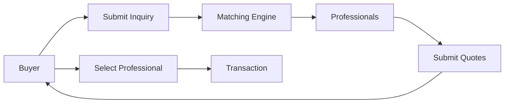

# APULINK Technical Architecture & System Documentation

**Version**: 1.0  
**Last Updated**: July 19, 2025  
**Platform**: Multi-sided marketplace for Italian property investment services  
**Region**: Puglia, Italy

---

## Table of Contents

1. [System Overview](#system-overview)
2. [Architecture Principles](#architecture-principles)
3. [Technology Stack](#technology-stack)
4. [System Architecture](#system-architecture)
5. [Database Design](#database-design)
6. [API Architecture](#api-architecture)
7. [Security Architecture](#security-architecture)
8. [Service Integrations](#service-integrations)
9. [Deployment Architecture](#deployment-architecture)
10. [Performance & Scalability](#performance--scalability)
11. [Monitoring & Observability](#monitoring--observability)
12. [Development Workflow](#development-workflow)

---

## 1. System Overview

### 1.1 Platform Description

APULINK is a B2B2C marketplace connecting international property buyers with Italian real estate professionals. The platform facilitates service discovery, matching, communication, and transaction management for property-related services in Puglia, Italy.

### 1.2 Core Actors

1. **Buyers**: International property investors seeking professional services
2. **Professionals**: Italian service providers (surveyors, architects, lawyers, notaries, etc.)
3. **Administrators**: Platform operators managing users, transactions, and quality

### 1.3 Key Business Flows



---

## 2. Architecture Principles

### 2.1 Design Principles

1. **Service-Oriented**: Professionals offer services, not just roles
2. **Multi-tenancy**: Shared infrastructure with data isolation
3. **Event-Driven**: Asynchronous processing for scalability
4. **API-First**: All functionality exposed via APIs
5. **Progressive Enhancement**: Core features work without JavaScript
6. **Mobile-First**: Responsive design prioritizing mobile experience

### 2.2 Technical Principles

1. **Separation of Concerns**: Clear boundaries between layers
2. **DRY (Don't Repeat Yourself)**: Reusable components and services
3. **SOLID Principles**: Maintainable, extensible code
4. **12-Factor App**: Cloud-native best practices
5. **Zero-Trust Security**: Verify everything, trust nothing

---

## 3. Technology Stack

### 3.1 Frontend

| Component | Technology | Version | Purpose |
|-----------|------------|---------|---------|
| Framework | Next.js | 14.2.3 | React framework with SSR/SSG |
| UI Library | React | 18.x | Component-based UI |
| Styling | Tailwind CSS | 3.x | Utility-first CSS |
| Forms | React Hook Form | 7.x | Form state management |
| Validation | Zod | 3.x | Schema validation |
| State | React Context | - | Global state management |
| HTTP Client | Native Fetch | - | API communication |

### 3.2 Backend

| Component | Technology | Version | Purpose |
|-----------|------------|---------|---------|
| Database | Supabase (PostgreSQL) | 14.x | Primary data store |
| Auth | Supabase Auth | - | Authentication service |
| Storage | Supabase Storage | - | File/document storage |
| Edge Functions | Netlify Functions | - | Serverless compute |
| CMS | Sanity | 3.x | Content management |
| Email | Resend | - | Transactional email |

### 3.3 Infrastructure

| Component | Technology | Purpose |
|-----------|------------|---------|
| Hosting | Netlify | Static site hosting |
| CDN | Netlify Edge | Global content delivery |
| DNS | Netlify DNS | Domain management |
| SSL | Let's Encrypt | HTTPS certificates |
| Monitoring | Netlify Analytics | Traffic analytics |

---

## 4. System Architecture

### 4.1 High-Level Architecture

```
┌─────────────────────────────────────────────────────────────┐
│                        Frontend (Next.js)                     │
├─────────────────────────────────────────────────────────────┤
│                    API Layer (Netlify Functions)             │
├─────────────────────────────────────────────────────────────┤
│   Supabase          │   Sanity CMS    │   External Services │
│   - Database        │   - Content      │   - Resend (Email)  │
│   - Auth           │   - Translations │   - Stripe (Payment)│
│   - Storage        │                  │                      │
└─────────────────────────────────────────────────────────────┘
```

### 4.2 Component Architecture

```
app/
├── (public)/              # Public pages
│   ├── page.tsx          # Landing page
│   ├── about/            # Static pages
│   └── pricing/          # Pricing page
├── (auth)/               # Authenticated pages
│   ├── dashboard/        # User dashboards
│   ├── profile/          # Profile management
│   └── settings/         # User settings
├── buyer/                # Buyer-specific flows
│   ├── inquiry/          # Submit inquiries
│   ├── quotes/           # View quotes
│   └── projects/         # Manage projects
├── professional/         # Professional flows
│   ├── register/         # Registration
│   ├── opportunities/    # View inquiries
│   └── quotes/           # Manage quotes
└── admin/                # Admin panel
    ├── users/            # User management
    ├── inquiries/        # Inquiry management
    └── analytics/        # Platform analytics
```

---

## 5. Database Design

### 5.1 Core Schema Overview

```sql
-- User Management
profiles (extends Supabase auth.users)
├── id (UUID, PK)
├── email
├── role (user|professional|admin)
└── created_at

-- Professional System
professionals
├── id (UUID, PK)
├── professional_type_id (FK)
├── company_name
├── service_areas (TEXT[])
└── is_verified

professional_types
├── id (UUID, PK)
├── code (surveyor|architect|lawyer|etc)
├── category (technical|legal|financial|etc)
└── requires_certification

-- Service Architecture
service_categories
├── id (UUID, PK)
└── name_en/name_it

service_subcategories
├── id (UUID, PK)
├── category_id (FK)
└── name_en/name_it

services
├── id (UUID, PK)
├── subcategory_id (FK)
├── typical_duration_days
└── requires_site_visit

professional_services
├── professional_id (FK)
├── service_id (FK)
├── pricing_model_id (FK)
└── base_price

-- Transaction Flow
inquiries
├── id (UUID, PK)
├── buyer_id (FK)
├── property_types (TEXT[])
├── locations (TEXT[])
├── budget_range
├── service_ids (UUID[])
└── status

quotes
├── id (UUID, PK)
├── inquiry_id (FK)
├── professional_id (FK)
├── total_price
└── status

-- Subscription & Billing
subscription_plans
├── id (UUID, PK)
├── stripe_price_id
├── name
├── tier (free|starter|pro|agency)
└── limits (JSONB)

subscriptions
├── id (UUID, PK)
├── professional_id (FK)
├── plan_id (FK)
├── stripe_subscription_id
└── status
```

### 5.2 Database Patterns

1. **Multi-tenancy**: Row-level security (RLS) policies
2. **Soft Deletes**: `deleted_at` timestamps instead of hard deletes
3. **Audit Trail**: `created_at`, `updated_at`, `created_by` on all tables
4. **JSONB Fields**: Flexible data storage for evolving requirements
5. **Array Fields**: PostgreSQL arrays for multi-value attributes

---

## 6. API Architecture

### 6.1 API Structure

```
/api/
├── auth/
│   ├── login
│   ├── register
│   └── logout
├── inquiries/
│   ├── create
│   ├── list
│   └── [id]/
├── professionals/
│   ├── register
│   ├── search
│   └── [id]/
├── quotes/
│   ├── create
│   ├── list
│   └── [id]/
├── admin/
│   ├── users/
│   ├── stats/
│   └── reports/
└── webhooks/
    ├── stripe
    └── sanity
```

### 6.2 API Standards

1. **RESTful Design**: Resource-based URLs
2. **HTTP Methods**: GET, POST, PUT, DELETE
3. **Status Codes**: Proper HTTP status codes
4. **Pagination**: Cursor-based pagination
5. **Filtering**: Query parameter filtering
6. **Sorting**: Multiple sort parameters
7. **Response Format**:
```json
{
  "success": true,
  "data": {},
  "meta": {
    "page": 1,
    "total": 100
  },
  "errors": []
}
```

---

## 7. Security Architecture

### 7.1 Authentication & Authorization

1. **Authentication**: Supabase Auth with JWT tokens
2. **Session Management**: Secure HTTP-only cookies
3. **Role-Based Access Control (RBAC)**:
   - User: Basic access
   - Professional: Service provider access
   - Admin: Full platform access
4. **Row-Level Security**: Database-level access control

### 7.2 Security Measures

1. **Data Encryption**:
   - At rest: AES-256 encryption
   - In transit: TLS 1.3
2. **Input Validation**: Zod schemas on all inputs
3. **SQL Injection Prevention**: Parameterized queries
4. **XSS Protection**: Content Security Policy headers
5. **CSRF Protection**: Double-submit cookies
6. **Rate Limiting**: API rate limits per user
7. **GDPR Compliance**: Data privacy controls

---

## 8. Service Integrations

### 8.1 Payment Processing (Stripe)

```typescript
// Subscription flow
1. Create customer
2. Create subscription
3. Handle webhooks:
   - payment_intent.succeeded
   - subscription.updated
   - invoice.payment_failed
```

### 8.2 Email Service (Resend)

```typescript
// Email templates
1. Buyer confirmation
2. Professional notification
3. Quote received
4. Payment confirmation
5. Weekly digest
```

### 8.3 Content Management (Sanity)

```typescript
// Content types
1. Static pages
2. Translations
3. Service descriptions
4. Legal documents
5. Help articles
```

---

## 9. Deployment Architecture

### 9.1 Deployment Pipeline

```yaml
1. Code Push → GitHub
2. GitHub Actions → Tests
3. Netlify Build → Deploy
4. Post-deploy → Migrations
```

### 9.2 Environment Strategy

| Environment | Purpose | URL |
|------------|---------|-----|
| Production | Live users | apulink.com |
| Staging | Pre-production testing | staging.apulink.com |
| Development | Active development | dev.apulink.com |

### 9.3 Configuration Management

```bash
# Environment variables
NEXT_PUBLIC_SUPABASE_URL
SUPABASE_SERVICE_ROLE_KEY
STRIPE_SECRET_KEY
RESEND_API_KEY
SANITY_PROJECT_ID
```

---

## 10. Performance & Scalability

### 10.1 Performance Optimization

1. **Frontend**:
   - Static generation for public pages
   - Image optimization with Next.js Image
   - Code splitting and lazy loading
   - Service worker for offline support

2. **Backend**:
   - Database indexing strategy
   - Query optimization
   - Connection pooling
   - Caching strategy (Redis future)

### 10.2 Scalability Plan

1. **Horizontal Scaling**: Serverless functions scale automatically
2. **Database Scaling**: Supabase managed scaling
3. **CDN Strategy**: Global edge caching
4. **Asset Optimization**: Cloudinary for images (future)

---

## 11. Monitoring & Observability

### 11.1 Monitoring Stack

1. **Application Monitoring**: Sentry (future)
2. **Performance Monitoring**: Web Vitals
3. **Error Tracking**: Console logs → Sentry
4. **Uptime Monitoring**: Better Uptime (future)
5. **Analytics**: Netlify Analytics + Google Analytics

### 11.2 Key Metrics

1. **Technical Metrics**:
   - Response time (p50, p95, p99)
   - Error rate
   - Database query time
   - API availability

2. **Business Metrics**:
   - User signups
   - Inquiry submission rate
   - Quote acceptance rate
   - Revenue per user

---

## 12. Development Workflow

### 12.1 Git Strategy

```
main
├── feature/billing-system
├── feature/admin-dashboard
├── fix/email-validation
└── hotfix/critical-bug
```

### 12.2 Development Process

1. **Planning**: GitHub Issues for features
2. **Development**: Feature branches
3. **Review**: Pull requests required
4. **Testing**: Automated tests (future)
5. **Deployment**: Auto-deploy on merge

### 12.3 Code Standards

1. **TypeScript**: Strict mode enabled
2. **Linting**: ESLint configuration
3. **Formatting**: Prettier standards
4. **Naming**: Consistent conventions
5. **Documentation**: JSDoc comments

---

## Appendices

### A. Technology Decisions

| Decision | Choice | Rationale |
|----------|--------|-----------|
| Database | PostgreSQL | Relational data, ACID compliance |
| Auth | Supabase Auth | Integrated with database |
| Hosting | Netlify | Great Next.js support |
| CMS | Sanity | Flexible content modeling |
| Payments | Stripe | Industry standard |

### B. Future Considerations

1. **Mobile Apps**: React Native implementation
2. **API Marketplace**: Public API for partners
3. **AI Features**: Matching algorithm ML
4. **Blockchain**: Smart contracts for escrow
5. **Expansion**: Other Italian regions

### C. Useful Commands

```bash
# Development
npm run dev              # Start development server
npm run build           # Build production
npm run type-check      # TypeScript validation

# Database
npx supabase db push    # Apply migrations
npx supabase db reset   # Reset database

# Deployment
git push main           # Auto-deploy to Netlify
```

---

**Document Version Control**

| Version | Date | Changes | Author |
|---------|------|---------|--------|
| 1.0 | July 19, 2025 | Initial documentation | System |

---

This document serves as the authoritative technical reference for the APULINK platform. It should be updated as the architecture evolves and new decisions are made.
